# SMB Underwriting Challenge — Submission

**Team: Closed-Loop Underwriting.** Our entry for the **Intuit TechWeek NYC 2026 SMB
Underwriting Challenge**: score small-business loan applicants for probability of
default, decide who to fund, project default trajectories, and answer causal "what-if"
queries — from data where the outcomes you most need are **systematically missing**.

This is the single source of truth for the repo. The deeper material lives in
[`METHODOLOGY.md`](METHODOLOGY.md) (methodology of record), [`LEARNINGS.md`](LEARNINGS.md)
(gotchas), and the graded writeup
[`submission/submission_D_writeup.md`](submission/submission_D_writeup.md). The dataset
guide is [`dataset/README.md`](dataset/README.md) (upstream Intuit material).

> **Status:** all four deliverables build end-to-end and pass the official validator
> (`RESULT: PASS`, 0 errors / 0 warnings). Proxy scorecard **0.5591** (see §5).

---

## 1. The challenge

You are a small-business lender. Using a historical book of loan applications, build a
model that **(A)** decides whom to fund, **(B)** forecasts how those loans default over
time, **(C)** answers causal "what-if" questions, and **(D)** defends the reasoning in a
short writeup. You submit **exactly four files, with exactly these names** on a held-out
population of **13,306** applicants (`validation.csv` + `test.csv`):

| | File | What it asks | Key rules |
|---|---|---|---|
| **A** | `submission_A_decisions.csv` | `decision` (1/0) + calibrated `predicted_pd` & 90% band per applicant | PD required for **everyone incl. declines**; `pd_lower_90 ≤ predicted_pd ≤ pd_upper_90` |
| **B** | `submission_B_trajectory.csv` | Cumulative default fraction by day `7a` for each (cohort_week, loan_age) — the *shape*, not one number | Full 13×13 = **169**-row grid; **non-decreasing in age** per cohort; band bounds ordered |
| **C** | `submission_C_counterfactuals.csv` | `predicted_pd_cf` for each of ~900 `do(feature = value)` queries | One row per `query_id`; band bounds ordered |
| **D** | `submission_D_writeup.pdf` | 5-section technical defense | ≤ 4 body pages, ≥ 11pt, ≥ 0.75in margins; §3 (causal) weighted most |

**Scored on:** portfolio profitability (A), cohort-timing accuracy (B), interval
calibration (A & B), counterfactual accuracy (C), and the writeup (D). Exact weights are
not published; we optimize against a proxy (§5).

**The catch — selective labels.** Outcomes (`default_flag`, timing, recovery) exist
*only* for loans the **legacy underwriter funded and that then matured**: 51,722 of
85,340 train rows, and **zero** test rows. The applicants you must score include all the
ones the old policy *declined* — and their ground truth does not exist. You cannot
directly measure how good your model is on the population you're graded on.

---

## 2. What the data forced

Three textbook assumptions break here, and each one changed a design decision. (All
numbers recomputed from the raw CSVs via `scripts/eda.py`.)

- **Positivity fails — globally.** The legacy funding rule is a *deterministic
  threshold*: `funded ⇔ prior_underwriter_score ≥ ~0.273`, **zero** mismatches, no
  overlap (max declined `0.27297` < min approved `0.27301`). So the funding propensity
  is degenerate {0,1}, and **IPW / doubly-robust reweighting is not identified** — there
  are no funded look-alikes for a declined applicant at the same score. We **fit the
  outcome model unweighted**, **remove the IPW path entirely** (`propensity.py` is a pure
  positivity *diagnostic*), and **exclude `prior_underwriter_score`** and its consequences
  from the features — ~44% of the decision population sits below the funded set's minimum
  score (out of training support). We bound or abstain rather than silently extrapolate.

- **The payoff is asymmetric and time-dependent.** A repaid loan nets `≈0.0875·R`; a
  default destroys most of `R`. And default *timing* is bimodal — in-term defaults span
  days 3–60, then a **spike at exactly day 90** with **zero** mass in between. The day-90
  spike recovers ≈ 0 (empirical recovery `0.0001` vs `0.118` in-term): near-total losses,
  not near-payers. A flat PD threshold can't see this; the decision rule must integrate
  over *when* default happens.

- **Missingness is structural.** The six bank-feed columns are null **iff**
  `has_linked_bank_feed == False`. Missingness is signal — we keep the NaNs (HistGB
  splits on them) and add `*_was_null` indicators rather than imputing.

---

## 3. Method: one hazard spine, four deliverables

A single **weekly competing-risks discrete-time hazard model** is the spine for all four
deliverables. One 3-class `HistGradientBoostingClassifier` on a person-period expansion
emits per-week hazards `h_d` (default) and `h_p` (payoff); the competing-risks recursion
gives `CIF_d(t)` and lifetime PD. The stack is **sklearn-only** (HistGB + isotonic),
all-float features with NaN preserved, deterministic per `(seed, compute budget)`.

On top of that spine sits the **WS1–WS5 scoring layer**:

```mermaid
flowchart TD
  data["train.csv — funded + matured only<br/>selective labels · 17.45% default"] --> ens["competing-risks hazard ensemble<br/>unweighted · prior_underwriter_score excluded"]
  ens --> A["A — decisions<br/>timing E&#91;NPV&#93; (WS1) + split-conformal band (WS3)"]
  ens --> B["B — trajectory<br/>cohort CIF + OOT recalibration (WS2)"]
  ens --> C["C — counterfactuals<br/>do() + g-computation (WS4)"]
  A --> sub["submission/{A,B,C}.csv + D writeup"]
  B --> sub
  C --> sub
  sub --> val{"validate_submission.py"}
  val -->|"PASS · 0 errors / 0 warnings"| ship["ready to upload"]
  ens -. measured on OOT funded holdout .-> sc["run_scorecard.py (WS5)<br/>weighted proxy 0.5591"]
```



- **A — timing-integrated E[NPV] (WS1) + split-conformal band (WS3).** Approve iff the
  NPV *integrated over default timing* is positive:
  `E[NPV] = Σ_t P(default in week t)·NPV(t) + P(repay)·0.0875R`, where `NPV(t)` credits
  the daily ACH draws a *late* in-term defaulter pays before defaulting and charges
  day-90-window defaults as total losses. The reported PD carries a **split-conformal**
  90% band (conformity measured on the raw point — a *fitted* recalibrator under-covers
  out-of-fold). This approves **~59%** (vs ~27% for the conservative flat rule),
  recovering profitable late-defaulters.
- **B — cohort trajectory + OOT recalibration (WS2).** Approved-cohort `CIF_d` averaged
  per (cohort_week, age), monotone by construction, with a single-parameter out-of-time
  recalibration (the hazard under-predicts on later cohorts, lifetime ratio ≈ 1.12).
- **C — `do()` with structural propagation + g-computation (WS4).** `dag.propagate_intervention`
  sets the intervened feature **and its deterministic descendants** (toggling
  `has_linked_bank_feed` rewrites the whole bank-feed block; ratios recompute), then reads
  lifetime PD off the ensemble — *standardization / g-computation in spirit*, with
  non-manipulable identity features (sector, vintage) refused rather than faked. Because
  real data can't validate interventional accuracy, a **fidelity-gated synthetic harness**
  (the sibling `closed-loop-default-detection` repo) certifies the *direction*: on the
  strong-propagation slice at severity 0.4, g-computation MAE **0.080 ± 0.014** vs naive
  conditioning **0.099 ± 0.015** across 5 seeds — gap positive on **5/5 seeds**, no sign
  flips.

---

## 4. What the data can never tell you (and how we got around it)

Three of the deliverables ask for something the selective-labels data structurally cannot
reveal. The fix, in each case, is to **plant the answer in a fidelity-checked synthetic
model**, hide it the way the real process does, and measure against it
(`closed-loop-default-detection`):

| Real data can't reveal… | because… | synthetic SCM gives |
|---|---|---|
| PD calibration on **declined** applicants | no outcomes for declines | true default planted for all, hidden via the approval policy — now measured on the **same SCM** as the counterfactual rows |
| **counterfactual** accuracy of `do(x)` | you never see a borrower both ways | structural equations → the *true* interventional PD |
| accuracy at default rates outside the realized window | only one realized regime | sweep the base rate / selection severity |

This is how Deliverable C's g-computation is certified on ground truth the real data
cannot provide — **across 5 seeds, no sign flips** at moderate selection (severity 0.4).
The certification is honest about its boundary: at full selection severity the advantage
is statistically zero (gap +0.002 ± 0.002, sign flip on one seed) — selection on an
*unobserved* confounder defeats backdoor adjustment, and we say so rather than claim a
small win. And the three rows are one experiment, not three: the declined-calibration
loop now runs on the SCM itself, where IPW holds declined-cohort ECE through severity
0.4 (0.087, seed 42) and fails at 0.6 — the same operating frontier, in the same synthetic world,
as the counterfactual result. This is why we report drivers as interventional effects
with the propagation made explicit, not raw observational correlations.

---

## 5. Results — and how they improved

The headline is a **proxy**, not the official score (the true score uses hidden test
labels + hidden per-term normalization). We measure where ground truth exists — fit on
train funded+matured loans, evaluate on the **out-of-time validation funded** holdout
(2,551 loans) — aggregated with the brief's published p.14 weights. Reproduce with
`python scripts/run_scorecard.py --compute high`.

**Two lineages were merged.** A *methodology-of-record* line made the outcome model
selective-label safe (drop `prior_underwriter_score`, remove IPW). A *scoring* line
(WS1–WS5) added economics, policy, calibration, and measurement. The shipped model is the
**scoring layer on top of the corrected model** — so the gains are real, not an artifact
of a weak baseline.

```mermaid
flowchart LR
  base["Step-0 baseline<br/>proxy 0.3499"]
  subgraph MoR["methodology-of-record line"]
    direction TB
    m1["drop prior_underwriter_score<br/>remove IPW (positivity fails)"]
    m2["isotonic OOT calibration<br/>+ Deliverable-D PDF"]
    m1 --> m2
  end
  subgraph WS["scoring line (WS1–WS5)"]
    direction TB
    w1["WS1 timing E&#91;NPV&#93; policy"]
    w2["WS2 CIF recalibration"]
    w3["WS3 split-conformal bands"]
    w4["WS4 g-computation (harness)"]
    w5["WS5 scorecard + figures"]
  end
  merged["shipped merge<br/>proxy 0.5591 · validator PASS (0/0)"]
  base --> MoR --> merged
  base --> WS --> merged
```



**Step-0 baseline → shipped (compute=high): weighted proxy `0.3499 → 0.5591` (+0.209).**

| Term | Weight | Baseline | Shipped | Δ·w | What changed — and what *kind* of change |
|---|---|---|---|---|---|
| **S_write** | 0.15 | 0.000 | 0.800 | **+0.120** | Deliverable artifacts now exist (scorecard, figures, writeup). **Bookkeeping, not model skill** — but 15% of the rubric, and the single largest contributor. |
| **S_traj** | 0.25 | 0.203 | 0.422 | **+0.055** | **Real modeling** — WS2 OOT CIF recalibration; cohort-weighted CDR MAE **0.0207 → 0.0150**. |
| **S_cal** | 0.20 | 0.797 | 0.912 | **+0.023** | **Real modeling** — WS3 split-conformal band; 90% coverage **0.70 → 0.89** at width 0.13. |
| **S_P&L** | 0.30 | 0.399 | 0.433 | **+0.010** | **Policy / risk choice** — WS1 timing E[NPV]. Headline **+$91,157** ($603,817 vs $512,660 flat) but only +0.010 normalized; approves **59%** vs ~27% — more modeled profit *and* more risk. |
| **S_C** | 0.10 | 0.201 | 0.213 | **+0.001** | WS4 g-computation, harness-certified (0.087 vs 0.109, single-seed scorecard config; 5-seed sweep in §3). Small at its 10% weight. |
| **Weighted** | | **0.3499** | **0.5591** | **+0.209** | |

**The honest read.** Of the +0.209: **+0.12 is "we produced the deliverables"** (real
under the rubric, not modeling), **+0.08 is genuine modeling** (trajectory recalibration +
conformal calibration), and the P&L "win" is a **+0.01 risk-appetite choice** behind a
$91K headline. Two caveats we state plainly:

- The baseline already shipped an isotonic OOT recalibration, so part of the WS2 gain
  existed independently — the table credits WS2 against the *original* Step-0 baseline.
- Compute scaling (`run_compute_curve.py`) shows the *modeling* terms rise monotonically
  low→high (**0.445 → 0.461 → 0.469** before the write bump); write adds a flat +0.09.

---

## 6. Key learnings

What we'd tell the next team, distilled from `LEARNINGS.md` and `docs/VERIFICATION.md`:

- **Identification, not estimation, was the binding constraint.** The deterministic
  funding rule means *no amount of reweighting* recovers declined-applicant outcomes.
  Recognizing that IPW was unsound here — and removing it — was worth more than any model
  tweak. Honest bounds beat a confident-looking number you can't defend to a regulator.
- **Let the data's structure pick the model.** Bimodal default timing → a *competing-risks
  hazard*, not a classifier. A point-mass payoff at day 60 and a day-90 loss spike →
  separate the two horizons in the NPV. Structural missingness → keep NaNs + indicators.
- **One fit, four deliverables.** A single 3-class hazard model (`{survive, default,
  payoff}`) gives `predict_proba = [1−h_d−h_p, h_d, h_p]` directly — hazards sum to ≤ 1,
  no duplicated frames — and A/B/C all read off it, so they can't disagree.
- **Calibration is decision-critical, not cosmetic.** The model under-predicts
  out-of-time (mean 0.187 vs realized 0.206); the fix moves *decisions*, not just a metric.
  Never report a fitted recalibrator's in-sample ECE/coverage (≈ optimal by construction) —
  gate on **cross-fitted / split-conformal held-out** numbers, measured on the **raw**
  point so you don't fool yourself.
- **`do()` ≠ conditioning, and say so where you can't prove it.** Counterfactuals must
  propagate structural descendants; for the rest, label it observational rather than
  overclaim a full SCM where positivity fails. When the real data can't validate a claim,
  build a *fidelity-gated synthetic oracle* and certify the **direction** there — with
  multi-seed error bars, not one lucky seed (strong-propagation MAE gap **+0.019 ± 0.005,
  positive on 5/5 seeds** at severity 0.4). The oracle also bounds the regime sharply:
  inside the frontier (severity ≤ 0.4) IPW holds declined-cohort calibration *and*
  g-computation reliably improves counterfactual MAE; beyond it, selection on an
  unobserved confounder defeats both — **one structural mechanism, two measured failure
  modes**, measured in the same synthetic world.
- **The validator is the law — and trust nothing's "PASS" until you've run it.** NaN is
  rejected everywhere (declines included); build by LEFT-JOIN onto the shipped
  `expected_ids/*` lists, not the data; B must be the exact 13×13 integer grid, monotone
  in age. The pipeline self-validates in-process at the end of every run.
- **Recompute, then refute.** Every number here came from the raw CSVs, and an adversarial
  verification pass caught a real bug — an earlier draft's decision rule was mathematically
  backwards (lower- vs upper-bound) — *before* it reached the writeup.

---

## 7. Reproduce

```bash
python -m venv .venv && . .venv/Scripts/activate     # Windows; use bin/activate on *nix
pip install -r requirements-dev.txt

unzip dataset/dataset-compressed.zip -d dataset/      # -> train/validation/test.csv

python scripts/eda.py                                 # structural facts about the data
python scripts/run_all.py                             # build submission/{A,B,C}.csv + validate (=> PASS)
python scripts/run_scorecard.py --compute high        # proxy scorecard -> reports/
python scripts/run_compute_curve.py                   # compute-scaling proof
python scripts/make_figures.py                        # P&L backtest figure
python scripts/make_writeup_pdf.py                    # submission/submission_D_writeup.{md -> pdf}
```

`--compute {low,med,high}` trades runtime for ensemble size / bootstrap reps and is
deterministic per `(seed, budget)`. The harness for C lives in the sibling
`closed-loop-default-detection` repo; `run_scorecard.py` locates it automatically.

## 8. Submit (official hard requirements)

1. **Register** your team on the challenge's Google Form — the private upload link is
   emailed to you. You cannot submit without registering.
2. **Build all four files** with the exact names in §1, **flat in one folder** (no
   nesting), using `dataset/submission_B_template.csv` for B.
3. **Validate until it prints `PASS`** — this is a hard gate; a submission that fails the
   validator is disqualified:
   ```bash
   python validate_submission.py submission/
   ```
   It checks exact names, ID coverage (against `expected_ids/*`), value ranges, the 13×13
   B grid, and per-cohort monotonicity. A missing D PDF is a WARN; A/B/C errors are fatal.
4. **Upload** the four files to your team's private link.

## 9. Layout

```
src/smb/
  config.py        loan economics, cohort/hazard constants, POLICY_RULE
  data.py          load/clean, cohort assignment, label + missingness
  features.py      all-float feature matrix + intervenable metadata + propagation
  survival_data.py weekly person-period builder (competing-risks layout)
  survival.py      competing-risks hazard ensemble; CIF; B trajectory + recalibration
  recovery.py      recovery rates by default timing (in-term vs day-90 spike)
  economics.py     timing-integrated E[NPV] over default-week probabilities (WS1)
  policy.py        portfolio decision rule: timing (shipped) / flat (baseline) (A)
  propensity.py    funding-rule + positivity DIAGNOSTICS only (IPW removed)
  model_pd.py      standalone binary HistGB+isotonic PD baseline (unweighted)
  calibration.py   clip/order, isotonic (OOT), ensemble + split-conformal bands (WS3)
  compute.py       compute-budget knobs (bag size, HP width, bootstrap reps)
  dag.py           intervention DAG + structural propagation (C)
  causal.py        counterfactual PD via do() off the hazard ensemble (C)
  pipeline.py      orchestrates -> submission/*.csv + in-process validate
scripts/
  eda.py / run_all.py / validate.py        explore · build+validate · re-gate
  run_scorecard.py / run_compute_curve.py  proxy scorecard · compute-scaling proof
  make_figures.py / make_writeup_pdf.py    P&L figure · writeup .md -> .pdf
dataset/           inputs (zip committed; unzipped CSVs gitignored) + data dictionary
expected_ids/      canonical ID lists the validator joins on
reports/           committed scorecard JSON + figures (proxy evidence)
submission/        the four deliverables (flat, exact names) + writeup .md/.pdf
```

## 10. Remotes

- `origin`   → `hossainpazooki/intuit-techweek-submission` (our private work)
- `upstream` → `intuit/intuit-techweek-nyc-hackathon-2026` (official challenge; pull only)
