# SMB Underwriting Challenge — Solution

Our solution to the Intuit TechWeek SMB Underwriting Challenge. The challenge
brief and dataset are upstream Intuit material (see `README.md`,
`dataset/README.md`); this file documents *our* approach and how to reproduce it.

> **Methodology of record: [`METHODOLOGY.md`](METHODOLOGY.md).** It is written to be
> judge-ready and honest — it separates what runs today (exploration + guardrails)
> from what is *proposed* (baseline) vs *aspirational* (research stack), and states
> the identification limits of the problem. Read it for the full technical argument;
> this file is the short orientation + run instructions.

**Honest status in one line:** the competing-risks hazard ensemble (fit **unweighted**,
no IPW; `prior_underwriter_score` excluded) is wrapped in a **score-weighted optimization
layer (WS1–WS5)** — a timing-integrated E[NPV] decision rule, split-conformal PD bands,
out-of-time trajectory recalibration, and a proxy scorecard — and produces A/B/C that
**pass the official validator** (`RESULT: PASS`, 0 warnings). The remaining
**stretch/aspirational** tiers (a broader LightGBM/XGBoost model family, DR-OPE, DML,
DeepHit) are proposed, not built; IPW reweighting is **removed** outright (positivity
fails, so it is not identified).

## How the results were improved

The headline is a **proxy** score, not the official one: the true score uses hidden
test labels and hidden per-term normalization. We measure where ground truth exists —
fit on train funded+matured loans, evaluate on the **out-of-time validation funded**
holdout (2,551 loans) — aggregated with the brief's published weights (p.14). Reproduce
with `python scripts/run_scorecard.py --compute high`.

**Two lineages were merged.** A *methodology-of-record* line fixed the outcome model to
be selective-label safe (drop `prior_underwriter_score`, remove IPW under global
positivity failure). A *scoring* line (WS1–WS5) added the economics, policy, calibration,
and measurement layers. The shipped model is the **scoring layer on top of the corrected
outcome model** — so the improvements below are real, not an artifact of a weaker
baseline.

```mermaid
flowchart LR
  base["Step-0 baseline<br/>proxy 0.3499"]
  subgraph MoR["methodology-of-record line"]
    direction TB
    m1["drop prior_underwriter_score<br/>remove IPW (positivity fails)"]
    m2["isotonic OOT calibration<br/>+ Deliverable-D PDF"]
    m1 --> m2
  end
  subgraph WS["scoring line (WS1–WS5)"]
    direction TB
    w1["WS1 timing E&#91;NPV&#93; policy"]
    w2["WS2 CIF recalibration"]
    w3["WS3 split-conformal bands"]
    w4["WS4 g-computation (harness)"]
    w5["WS5 scorecard + figures"]
  end
  merged["shipped merge<br/>proxy 0.5591 · validator PASS (0/0)"]
  base --> MoR --> merged
  base --> WS --> merged
```



**Step-0 baseline → shipped (compute=high): weighted proxy `0.3499 → 0.5591` (+0.209).**

| Term | Weight | Baseline | Shipped | Δ·w | What changed — and what *kind* of change it is |
|---|---|---|---|---|---|
| **S_write** | 0.15 | 0.000 | 0.800 | **+0.120** | *Deliverable artifacts now exist* (scorecard, P&L + compute-curve figures, writeup). **Bookkeeping, not model skill** — but 15% of the rubric. Largest single contributor. |
| **S_traj** | 0.25 | 0.203 | 0.422 | **+0.055** | **Real modeling** — WS2 out-of-time CIF recalibration (`fit_cif_scale`); cohort-weighted CDR MAE **0.0207 → 0.0150**. |
| **S_cal** | 0.20 | 0.797 | 0.912 | **+0.023** | **Real modeling** — WS3 split-conformal PD band; 90% interval coverage **0.70 → 0.89**. |
| **S_P&L** | 0.30 | 0.399 | 0.433 | **+0.010** | **Policy choice** — WS1 timing-integrated E[NPV] (`rule="timing"`). Headline "+$91,157 vs flat" but only +0.010 normalized; approves **59%** vs the flat rule's ~27% — more modeled profit *and* more risk. |
| **S_C** | 0.10 | 0.201 | 0.213 | **+0.001** | WS4 g-computation, certified against the `closed-loop-default-detection` harness (g-comp MAE **0.085** vs naive conditioning **0.109**). Small normalized weight. |
| **Weighted** | | **0.3499** | **0.5591** | **+0.209** | |

**The honest read.** Of the +0.209, **+0.12 is "we produced the deliverables"** (real
under the rubric, but not modeling), **+0.08 is genuine modeling** (trajectory
recalibration + conformal calibration), and the P&L "win" is a **+0.01 risk-appetite
choice** dressed up as a $91K headline. C is a near-wash at its 10% weight. Two caveats
worth stating plainly:

- The **baseline already shipped an isotonic OOT recalibration**, so part of the WS2
  trajectory gain existed independently on the prior line; the table credits WS2 against
  the *original* Step-0 baseline, which had neither.
- Compute scaling (`scripts/run_compute_curve.py` → `reports/compute_curve.csv`) shows
  the *modeling* terms rise monotonically low→high (weighted **0.445 → 0.461 → 0.469**
  before the write bump); the write component adds a flat +0.09 on top to reach 0.559.

## Quick start

```bash
python -m venv .venv && . .venv/Scripts/activate   # Windows; use bin/activate on *nix
pip install -r requirements-dev.txt

unzip dataset/dataset-compressed.zip -d dataset/    # -> train/validation/test.csv

python scripts/eda.py             # structural facts about the data
python scripts/run_all.py         # build submission/{A,B,C}.csv + validate (=> PASS)
python scripts/validate.py        # re-run Intuit's gate; must print PASS
python scripts/run_scorecard.py --compute high   # proxy scorecard -> reports/
python scripts/run_compute_curve.py              # compute-scaling proof
python scripts/make_figures.py    # P&L backtest figure
python scripts/make_writeup_pdf.py               # submission/submission_D_writeup.{md->pdf}
```

## What the data is (verified — drives every modeling choice)

- **Temporal split.** train = Jan 2024–Jun 2025 (the past); validation + test =
  the 13 weekly cohorts Jun 30–Sep 28 2025 (the forecast window). We decide on
  validation + test = **13,306** applicants for Deliverable A.
- **Selective labels with a *deterministic* funding rule.** Outcomes exist *only*
  for funded, matured loans (51,722 of 85,340 train rows; **17.45%** default rate).
  The legacy funding decision is a **perfect threshold** on `prior_underwriter_score`
  (`prior_decision==1 iff score>=~0.273`, zero mismatches, no overlap) — so the
  funding propensity is degenerate and **positivity fails globally**. IPW / DR are
  *not identified* for declined applicants; we bound or abstain rather than reweight.
- **Default timing has a point mass.** Paid loans repay at **exactly day 60**;
  defaults span days 3–60 and then a **spike at exactly day 90** (~22.5%), with none
  in between. Interest accrues over the 60-day term; default is observed through day 90
  — the NPV must separate the two horizons.
- **Informative missingness.** Bank-feed block is null **iff**
  `has_linked_bank_feed==False` (~36% of train); `days_since_*` nulls mean "no prior event."
  Missingness is signal — keep NaNs + indicators, don't blind-impute.
- **Causal vs predictive (C).** `do(feature=value)` ≠ conditioning; a one-feature
  re-score (or a SHAP value) is *observational*. We propagate structural features
  (bank-feed block, engineered ratios) and report everything else as observational
  with the gap surfaced.

## Decision rule (shipped: timing-integrated E[NPV])

Default *timing* carries the economics: a loan that repays returns ~8.75% of principal,
a *late in-term* defaulter still pays the daily ACH draws it makes before defaulting, and
a day-90-window default is a near-total loss (empirical recovery ≈ 0.0001 vs 0.118
in-term — two rates from `recovery.estimate_recovery_rates_by_timing`). So the shipped
rule (`config.POLICY_RULE = "timing"`, `policy.portfolio_decisions`) **approves iff the
expected NPV integrated over default timing is positive**,
`E[NPV] = Σ_t P(default in week t)·NPV(t) + P(repay)·0.0875R`. A flat PD threshold
over-declines profitable late-defaulters; the timing rule recovers them — **+$91,157**
on the OOT funded holdout ($603,817 vs $512,660), at a **59%** approval rate.

The prior **flat** rule (approve iff E[NPV] > 0 at the *upper* PD bound; break-even
PD ≈ 8.0–8.9%) is retained as `rule="flat"` and is the conservative baseline the
scorecard compares against. The reported PD columns carry a **split-conformal** 90% band
(`calibration.fit_pd_band`); an isotonic OOT path (`config.APPLY_OOT_CALIBRATION`) remains
available but is not the shipped recalibrator. See `METHODOLOGY.md` §3 and §9.

## Pipeline at a glance

One fit feeds all four deliverables; WS1–WS5 are the labelled add-ons on top of the
selective-label-safe ensemble. The validator and the proxy scorecard are the two gates.

```mermaid
flowchart TD
  data["train.csv — funded + matured only<br/>(selective labels, 17.45% default)"] --> ens["competing-risks hazard ensemble<br/>unweighted · prior_underwriter_score excluded"]
  ens --> A["A — decisions<br/>timing E&#91;NPV&#93; (WS1) + split-conformal band (WS3)"]
  ens --> B["B — trajectory<br/>cohort CIF + OOT recalibration (WS2)"]
  ens --> C["C — counterfactuals<br/>do() + g-computation (WS4)"]
  A --> sub["submission/{A,B,C}.csv + D writeup"]
  B --> sub
  C --> sub
  sub --> val{"validate_submission.py"}
  val -->|"PASS · 0 errors / 0 warnings"| ship["ready to upload"]
  ens -. measured on OOT funded holdout .-> sc["run_scorecard.py (WS5)<br/>weighted proxy 0.5591"]
```



## Layout

All modules below are implemented. `survival_data`, `propensity`, `recovery`, `dag`,
`economics`, `compute` are modules added during implementation.

```
src/smb/
  config.py        loan economics + cohort/hazard constants
  data.py          load/clean, cohort assignment, label + missingness
  features.py      numeric feature matrix + intervenable metadata + propagation
  survival_data.py weekly person-period builder (competing-risks layout)
  survival.py      competing-risks hazard ensemble; CIF; B trajectory
  recovery.py      recovery rates by default timing (in-term vs day-90 spike)
  propensity.py    funding-rule + positivity DIAGNOSTICS only (IPW removed)
  model_pd.py      standalone binary HistGB+isotonic PD baseline (unweighted)
  economics.py     timing-integrated E[NPV] over default-week probabilities (WS1)
  policy.py        portfolio decision rule: timing (shipped) / flat (baseline) (A)
  calibration.py   clip/order, isotonic (OOT), ensemble + split-conformal bands (WS3)
  compute.py       compute-budget knobs (bag size, HP width, bootstrap reps)
  dag.py           intervention DAG + structural propagation (C)
  causal.py        counterfactual PD via do() off the hazard ensemble (C)
  pipeline.py      orchestrates -> submission/*.csv + in-process validate
scripts/
  eda.py              reproducible exploration / premise validation
  run_all.py          build all deliverables + validate  (=> RESULT: PASS)
  validate.py         wrapper around Intuit's validate_submission.py
  run_scorecard.py    proxy scorecard (weighted by the brief's p.14 weights)
  run_compute_curve.py compute-scaling proof -> reports/compute_curve.csv
  make_figures.py     P&L backtest figure
  make_writeup_pdf.py submission_D_writeup.md -> .pdf
reports/            committed scorecard JSON + figures (proxy evidence)
submission/         the four output files (flat, exact names) + writeup .md/.pdf
```

## Deliverable status

End-to-end and passing; WS1–WS5 scoring layer shipped, stretch/aspirational tiers proposed.

- [x] **Premises validated** — `scripts/eda.py` (selective labels, deterministic
      funding rule, timing, missingness, overlap, query structure, cohort sizes).
- [x] **A** — decisions: competing-risks lifetime PD (outcome model excludes the
      legacy `prior_underwriter_score`; fit unweighted, no IPW) → **timing-integrated
      E[NPV]** decision (WS1) with a **split-conformal** 90% PD band (WS3). Approves
      **~59%** at the point-E[NPV] bound (vs ~27% for the conservative flat rule),
      recovering profitable late-defaulters (+$91,157 OOT).
- [x] **B** — trajectory: cohort × loan-age cumulative default off the hazard
      ensemble over approved loans, monotone by construction, with **out-of-time CIF
      recalibration** (WS2; CDR MAE 0.0207 → 0.0150).
- [x] **C** — counterfactuals: do() off the ensemble with structural propagation
      (bank-feed block, engineered ratios); g-computation certified against the
      `closed-loop-default-detection` harness (MAE 0.085 vs naive 0.109).
- [x] **D** — writeup: `submission/submission_D_writeup.md` on the official 5-section
      template (§3 causal weighted most), distilled from `METHODOLOGY.md` → exported to
      `submission/submission_D_writeup.pdf`. **Note:** the writeup prose still carries
      pre-merge P&L numbers ($570K/+$214K); refresh to the shipped model
      ($603,817/+$91,157) before final upload (see merge-commit follow-up).

## Remotes

- `origin`  → private repo (our work)
- `upstream` → `intuit/intuit-techweek-nyc-hackathon-2026` (official; pull updates only)
